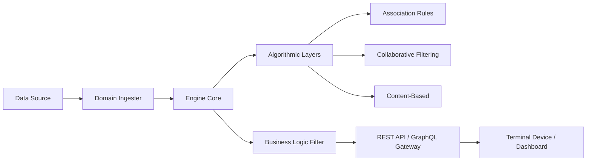

# Integration Architecture — Axiom Hive Smart Pairing Engine

[](https://github.com/AXIOMHIVE/example-purchase-model)
[](https://github.com/AXIOMHIVE/example-purchase-model)
[](https://github.com/AXIOMHIVE/example-purchase-model)

The **Smart Pairing Engine (v2.0)** is designed with a **Modular Integration Architecture**, allowing it to function as a domain-agnostic "Recommendation Brain" behind any backend ecosystem. It can be applied to Retail, Legal Knowledge Graphs, Media Streaming, and more.

---

## ◈ System Topography

The engine follows a **Hub-and-Spoke integration model**, where the `EngineService.js` acts as the central processor, receiving raw data and outputting optimized pairings.

### 1. The Integration Flow



### 2. Core Components

- **`core/EngineService.js`**: The main orchestrator. It is instantiated with raw data and a configuration object.
- **`core/presets.js`**: Pre-defined weighting strategies (Retail, Legal, Media) for divergent use cases.
- **`engine/`**: The internal mathematical layers (ARL, CF, CB, Clickstream).

---

## ◈ Implementation Guide

### Strategy 1: The "Direct Plug" (Standalone Node.js Backend)

For developers using Express, Koa, or NestJS, the engine can be integrated directly into the middleware.

```javascript
/* Standard Integration Boilerplate */
const SmartPairingEngine = require('./core/EngineService');
const PRESETS = require('./core/presets');

// 1. Initialize with Domain Preset (e.g., Media Streaming)
const engine = new SmartPairingEngine(rawData, PRESETS.MEDIA_STREAMING);

// 2. Map Domain Data to Engine Schema
// (Product SKU → Track ID, Category → Genre, User → Viewer)
app.get('/api/recommendations/:userId', (req, res) => {
  const recs = engine.getRecommendations(req.params.userId);
  res.json(recs);
});
```

### Strategy 2: Modular Configuration

The engine supports dynamic configuration updates, allowing A/B testing or real-time weighting adjustments based on seasonal KPIs.

```javascript
/* Dynamic Weight Calibration */
engine.updateConfig({
  weights: {
    associationRules: 0.60, // Boost co-occurrence for Black Friday
    popularity: 0.40        // Focus only on trending items
  }
});
```

---

## ◈ Domain-Specific Configurations

The engine can be recalibrated for any domain by adjusting the **Weighted Score Matrix**:

| Domain | ARL Weight | CF Weight | CB Weight | Primary Heuristic |
| :--- | :--- | :--- | :--- | :--- |
| **E-Commerce** | 0.40 | 0.30 | 0.15 | Customers Who Bought X... |
| **Legal** | 0.20 | 0.20 | 0.50 | Case Precedent & Metadata |
| **Media** | 0.15 | 0.45 | 0.20 | Users Like You Also Viewed |

### Key Integration Benefits

- **Domain Agnosticism**: Map any object with a unique ID and category to the `SmartPairingEngine`.
- **Cold Start Resilience**: Content-based filtering ensures new items are recommended even without transaction history.
- **Automated Maintenance**: The `syncLifecycle()` method automates catalog cleanup and trending injections.

---

## ◈ Technical Foundations (Citations)

- **Baldwin & Clark (2000)**: "Design Rules: The Power of Modularity" — Establishing the foundation for the Hub-and-Spoke architecture.
- **Vernon (1966)**: "International Product Life Cycle" — Theoretical basis for the automated removal of declining SKUs.
- **Fowler (2015)**: "Microservices Architecture" — Patterns for modularity and integration at scale.

---

Developed by **NMG** for **Axiom Hive**.  
*Integration Architecture Release 2.0 — March 2026*
